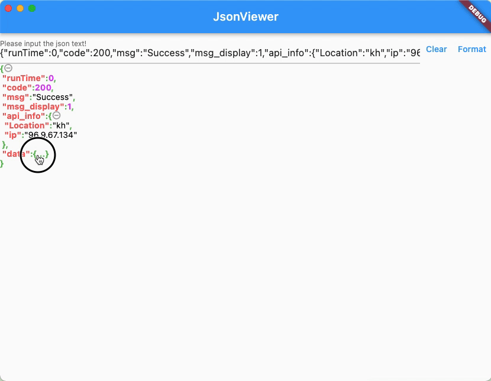

# json_viewer

一个简单的项目，格式化json，并支持json收缩跟扩展，目前用在项目请求返回后进行数据格式化跟查看</br>
A simple project that formats json and supports json contraction and expansion. It is currently used
for data formatting and viewing after the project request is returned.

## Getting Started

```dart
  ///just like this, to use the widget,support data like String,Map,and List
  JsonShrinkWidget(json: _controller.text);
```
