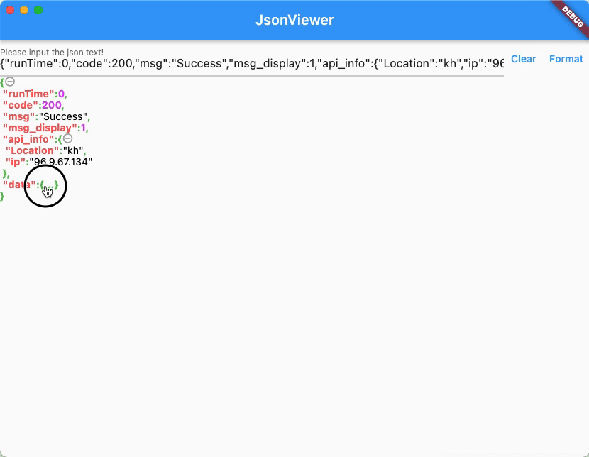

# Guia do JSON Viewer

[English](guide_en.md) | [简体中文](guide_cn.md) | [Deutsch](guide_de.md) | Português | [日本語](guide_jp.md) | [한국어](guide_kr.md)

## Introdução

JSON Viewer é um widget Flutter para formatar e exibir dados JSON, com suporte para expandir e recolher nós JSON. É principalmente usado para visualizar dados de resposta de API em aplicativos.



## Instalação

Adicione a dependência no pubspec.yaml:

```yaml
dependencies:
  json_shrink_widget: ^1.2.0
```

## Uso Básico

Forma mais simples de usar:

```dart
JsonShrinkWidget(
  json: jsonString  // Suporta tipos String, Map e List
)
```

## Configuração Avançada

JsonShrinkWidget suporta as seguintes opções de configuração:

- `shrink`: bool - Se deve recolher por padrão, padrão é false
- `deep`: int - Nível de profundidade de travessia JSON
- `indentation`: String - Caractere de indentação
- `style`: JsonShrinkStyle - Configuração de estilo
- `deepShrink`: int - Nível de recolhimento padrão
- `showNumber`: bool - Se deve mostrar o número de elementos em arrays/objetos
- `urlSpanBuilder`: Function - Estilo personalizado de exibição de link URL

Exemplo de configuração de estilo:

```dart
JsonShrinkWidget(
  json: jsonString,
  shrink: true,  // Recolhido por padrão
  deep: 3,       // Atravessa 3 níveis
  indentation: "  ",  // Usa 2 espaços para indentação
  style: JsonShrinkStyle(
    // Estilos personalizados
    keyStyle: TextStyle(color: Colors.blue),
    valueStyle: TextStyle(color: Colors.black),
    symbolStyle: TextStyle(color: Colors.grey)
  ),
  showNumber: true  // Mostra contagem de elementos
)
```

## Recursos

1. Suporte para Múltiplos Tipos de Dados
- String JSON
- Map
- List

2. Controle Flexível de Exibição
- Clique para recolher/expandir nós JSON
- Definir nível de recolhimento padrão
- Estilo de indentação personalizado

3. Efeitos Visuais Amigáveis
- Destaque de sintaxe
- Alinhamento formatado
- Exibição opcional de contagem de elementos

4. Configuração Personalizada
- Personalização de estilo
- Tratamento de link URL
- Controle de indentação

## Exemplos

1. Exibição Básica de JSON:

```dart
String jsonStr = '''
{
  "name": "JSON Viewer",
  "version": "1.2.0",
  "author": "infinity"
}
''';

JsonShrinkWidget(
  json: jsonStr
)
```

2. Configuração com Estilo:

```dart
JsonShrinkWidget(
  json: jsonData,
  style: JsonShrinkStyle(
    keyStyle: TextStyle(
      color: Colors.blue,
      fontWeight: FontWeight.bold
    ),
    valueStyle: TextStyle(
      color: Colors.black87
    )
  )
)
```

3. Mostrar Contagem de Elementos do Array:

```dart
JsonShrinkWidget(
  json: listData,
  showNumber: true,  // Mostra comprimento do array
  shrink: true      // Recolhido por padrão
)
```

## Notas Importantes

1. A string JSON de entrada deve estar em formato JSON válido
2. Recomenda-se definir uma profundidade de travessia apropriada (parâmetro deep) com base no tamanho dos dados
3. Para dados JSON grandes, recomenda-se usar o modo recolhido por padrão
4. A configuração de estilo suporta personalização completa de acordo com o tema do aplicativo

## Problemas Comuns

1. Falha na Análise JSON
- Verifique se o formato da string JSON está correto
- Verifique se a codificação da string é UTF-8

2. Problemas de Desempenho
- Controle adequadamente o parâmetro deep
- Use o modo recolhido para conjuntos grandes de dados

3. Problemas de Estilo
- Verifique se a configuração de estilo está correta
- Confirme os parâmetros TextStyle 